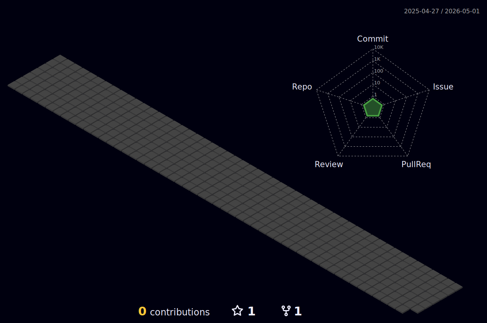

 
   
   
<!--    -->
   
<!--     -->
<!--    -->
   
   
<!--    -->

  
<!--    -->
<!--    -->
<!--    -->
  
  
  
<!--    -->
<!--    -->

  

    
    
  

팀 작업 1. 이세상에 없는 상품을 파는 상점 만들기
 
https://github.com/Songehyun/subject-7-exam-database-1.git
 
개인 작업 1. 패치노트 올릴 수 있는 블로그 만들기
 
https://github.com/Songehyun/makeblog.git
